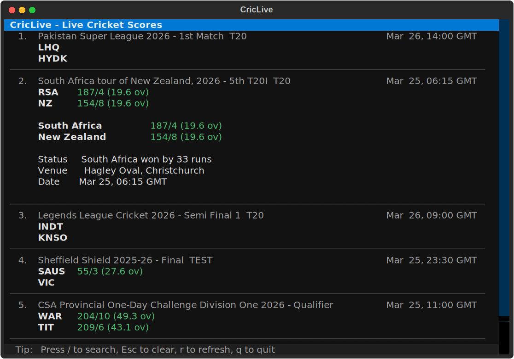

# criclive

**Live cricket scores in your terminal.**

[](https://pypi.python.org/pypi/criclive)
[](https://github.com/aktech/criclive/actions/workflows/test.yml)
[](https://opensource.org/licenses/MIT)
[](https://pypi.python.org/pypi/criclive)

## Install

### Using pip

```
pip install criclive
```

### Using pixi

```
git clone https://github.com/aktech/criclive.git
cd criclive
pixi install
```

## Usage

```
criclive
```



### Options

| Flag | Description |
|------|-------------|
| `--json` | Output scores as JSON |
| `--interval N` | Auto-refresh interval in seconds (default: 5) |

### Keyboard Shortcuts

| Key | Action |
|-----|--------|
| `/` | Filter matches by team, series, or format |
| `Esc` | Clear filter |
| `r` | Refresh scores |
| `q` | Quit |

Click on a match to expand detailed view with venue, full team names, and status.

### Plain text output

```
criclive-plain
```

## Development

```bash
git clone https://github.com/aktech/criclive.git
cd criclive
pixi install
pixi run start    # run criclive
pixi run test     # run tests
```

## Contributing

Use GitHub's Pull request/issues feature for all contributions.

## License

MIT
